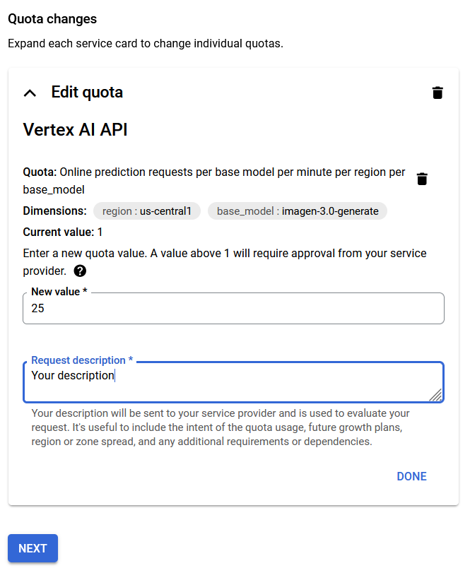

# Vertex AI set up instructions

## Set up a project and a development environment

https://cloud.google.com/vertex-ai/docs/start/cloud-environment

## Install the Vertex AI SDK for Python

https://cloud.google.com/vertex-ai/docs/start/install-sdk

Installation of the Vertex AI SDK for Python includes the following steps:

1. Create an isolated Python environment
2. Install the Vertex AI SDK package
3. Initialize the Vertex AI SDK (This is done within the python script itself)

# Script execution instructions

## Using pyenv to create a virtual environment (Installation instructions for Ubuntu: https://medium.com/@aashari/easy-to-follow-guide-of-how-to-install-pyenv-on-ubuntu-a3730af8d7f0)

1. Install python version 3.8.16 using pyenv:

```
pyenv install 3.8.16
```

2. Select the python version 3.8.16 for local:

```
pyenv local 3.8.16
```

3. Run the following command to create a virtual environment

```
pyenv exec python -m venv .venv
```

## Install Python dependencies in requirements.txt file after activating your Python virtual environment

1. Create an isolated Python environemnt and activate it (https://cloud.google.com/python/docs/setup#linux)
2. Run the following command to install Python dependencies in the requirements.txt file:

```
python -m pip install -r requirements.txt
```

## Environment variables in .env file

PROJECT_ID: Your Google Cloud Provider project id.

## Optional: For Windows VSCode (WSL required https://learn.microsoft.com/en-us/windows/wsl/install)

1. Open a WSL terminal
2. Run the following command to open the folder within a WSL window.

```
code .
```

## Script execution:

```
python single_image_demo.py
python multi_image_demo.py
```

## More code samples for image generation

https://cloud.google.com/vertex-ai/generative-ai/docs/samples/generativeaionvertexai-imagen-generate-image

## Request to increase Vertex AI quota

1. Navigate to https://console.cloud.google.com/iam-admin/quotas
2. Click on Edit Quota for the desired service.
   
3. Fill out the form for the request.
   
